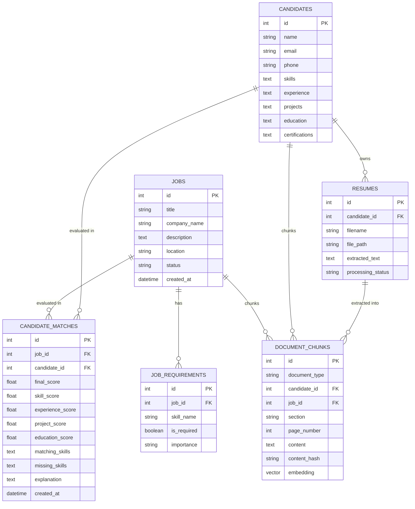

# AI Recruitment & Candidate Intelligence Platform
## Complete System Guide, Architecture Explanation & Operational Workflow

---

## 📑 Table of Contents
1. [Executive Overview & Core Problem](#1-executive-overview--core-problem)
2. [Why Traditional AI Screening Fails](#2-why-traditional-ai-screening-fails)
3. [High-Level Architecture](#3-high-level-architecture)
4. [Step-by-Step Pipeline Workflows](#4-step-by-step-pipeline-workflows)
   - [Pipeline A: Job Intelligence & Decomposition](#pipeline-a-job-intelligence--decomposition)
   - [Pipeline B: Resume Ingestion & Section Chunking](#pipeline-b-resume-ingestion--section-chunking)
   - [Pipeline C: LangGraph Matching & Scoring](#pipeline-c-langgraph-matching--scoring)
5. [The Deterministic Scoring Formula](#5-the-deterministic-scoring-formula)
6. [Hybrid Retrieval & Evidence Reranking (RAG)](#6-hybrid-retrieval--evidence-reranking-rag)
7. [Skill-Gap Analysis & Upskilling Engine](#7-skill-gap-analysis--upskilling-engine)
8. [Database Schema & Data Models](#8-database-schema--data-models)
9. [How to Run the Entire Project (Complete Guide)](#9-how-to-run-the-entire-project-complete-guide)
10. [REST API Endpoints Reference](#10-rest-api-endpoints-reference)
11. [Testing & Evaluation Framework](#11-testing--evaluation-framework)

---

## 1. Executive Overview & Core Problem

Hiring technical talent today suffers from two major extremes:
1. **Keyword-based ATS (Applicant Tracking Systems)**: Rejects qualified candidates because they wrote "FastAPI" instead of "Python web framework", or "Postgres" instead of "PostgreSQL".
2. **Naive GenAI Screening**: Dumping entire resumes and job descriptions into an LLM and asking *"Score this candidate from 1 to 100"*. This produces non-deterministic hallucinations, cannot cite evidence, and introduces severe regulatory compliance risks.

### The Solution:
This platform is an **Enterprise Retrieval-Augmented Generation (RAG) and Deterministic Matching Platform**. It combines:
- **LLM Structured Extraction**: Automatically converts raw text/PDFs into strict Pydantic schemas.
- **SkillGraph Normalization**: Resolves acronyms, synonyms, and sub-skills (e.g., `FastAPI` $\rightarrow$ `Python`, `Web Framework`).
- **Hybrid Retrieval (pgvector + FTS)**: Uses both semantic embeddings (meaning) and lexical matching (exact versions/libraries) with Reciprocal Rank Fusion (RRF).
- **Cross-Encoder Reranking**: Re-scores chunks for maximum precision.
- **Deterministic Scoring Engine**: Calculates mathematical scores using weighted formulas. **The LLM never generates the score.**
- **Grounded Explanations**: Every claim is cited with page numbers and resume quotes.

---

## 2. Why Traditional AI Screening Fails

```
❌ NAIVE APPROACH (Dangerous & Unreliable):
[Raw Resume PDF] + [Job Description] ──► [LLM Prompt: "Score this 0-100"] ──► 78% (Hallucinated Score)
- No audit trail
- No cited proof
- Changes score every time you refresh
- Subject to prompt injection and bias

✅ THIS PLATFORM'S ARCHITECTURE:
[Raw Resume PDF]
       │
       ▼ (PyMuPDF / docx Parser)
[Section-Aware Chunks + Page # Metadata]
       │
       ▼ (Gemini Embeddings + PostgreSQL FTS)
[Hybrid RAG Retrieval Engine + RRF]
       │
       ▼ (Cross-Encoder Reranker)
[High-Precision Evidence Set with Page Citations]
       │
       ▼
[Deterministic Scoring Formula (Math, Not LLM)] ──► Score: 78.2 / 100 (100% Deterministic)
       │
       ▼
[Skill-Gap Analysis Engine] ──────────────────────► Missing: Docker, FastAPI
       │
       ▼
[LLM Grounded Justification] ─────────────────────► Synthesizes Summary using ONLY verified chunks
```

---

## 3. High-Level Architecture

The platform consists of four decoupled layers:

```
┌─────────────────────────────────────────────────────────────────────────────┐
│                       1. FRONTEND USER INTERFACE                            │
│  React + Vite (Simple, Clean, Functional Vanilla CSS)                      │
│  - Recruiter Dashboard         - Active Job Postings                        │
│  - Resume Uploader             - Interactive Matching & Score Breakdown     │
│  - Skill-Gap Matrix            - Grounded Resume Quotations & Citations     │
└──────────────────────────────────────┬──────────────────────────────────────┘
                                       │ HTTP / REST (Port 8000)
┌──────────────────────────────────────▼──────────────────────────────────────┐
│                       2. FASTAPI BACKEND API LAYER                          │
│  - `/jobs` (CRUD & Decomposition)    - `/candidates` (Profiles & Pools)     │
│  - `/resumes` (Upload & Extract)     - `/matches` (LangGraph Match Flow)    │
│  - `/health` (Telemetry & Status)    - Storage Service (Local / Supabase)   │
└──────────────────────────────────────┬──────────────────────────────────────┘
                                       │
┌──────────────────────────────────────▼──────────────────────────────────────┐
│                    3. AI & RAG INTELLIGENCE PIPELINE                        │
│  - LangGraph State Machine (10-Step Execution Flow)                         │
│  - Document Section Chunker (Experience, Education, Projects, Skills)        │
│  - Google Gemini 1.5 Flash (Structured Extraction & Grounded Synthesis)     │
│  - Google Gemini Embeddings (768-dimensional normalized vectors)            │
│  - SkillGraph Normalizer (Canonical skill resolution & relationships)       │
│  - Reciprocal Rank Fusion (RRF) & Cross-Encoder Precision Reranker          │
│  - Deterministic Mathematical Scoring Engine (Configurable Category Weights)│
└──────────────────────────────────────┬──────────────────────────────────────┘
                                       │
┌──────────────────────────────────────▼──────────────────────────────────────┐
│                       4. DATA & PERSISTENCE LAYER                           │
│  - SQLite (Local Development) / Supabase PostgreSQL + pgvector (Production) │
│  - Tables: jobs, job_requirements, candidates, resumes, chunks, matches     │
│  - Full-Text Search Indexes (`tsvector`, BM25 token frequencies)            │
│  - Storage: Local storage (`data/storage/`) or Supabase Storage Buckets     │
└─────────────────────────────────────────────────────────────────────────────┘
```

---

## 4. Step-by-Step Pipeline Workflows

### Pipeline A: Job Intelligence & Decomposition
1. **Job Creation**: Recruiter posts a raw job description via UI or API (`POST /jobs/`).
2. **AI Extraction**: The backend passes the job description to Gemini with strict Pydantic constraints:
   - Extracts job title, company, location.
   - Decomposes responsibilities into discrete **Atomic Requirements** (e.g., `Python (Required, High)`, `FastAPI (Required, High)`, `Kubernetes (Preferred, Medium)`).
3. **Skill Normalization**: Each skill is mapped to its canonical name in the `SkillGraph` (e.g., "Postgres 14" $\rightarrow$ "PostgreSQL", Category: "Databases").
4. **Vector Embedding**: Each requirement is embedded into a 768-dimensional float vector and stored in `document_chunks`.

---

### Pipeline B: Resume Ingestion & Section Chunking
1. **Document Parsing**: Candidate uploads a PDF or DOCX file.
   - `PyMuPDF` extracts raw text and tracks exact page boundaries.
   - Cleans unicode artifacts and computes a SHA-256 content hash for deduplication.
2. **Profile Structuring**: Gemini extracts structured candidate fields:
   - Full Name, Email, Phone, LinkedIn.
   - List of declared technical skills.
   - Work history entries (Company, Role, Duration, Bullet points, Skills used).
   - Project entries (Name, Tech stack, Description).
   - Education & Certifications.
3. **Section-Aware Chunking**:
   - Instead of naive character chunking, documents are split along semantic section boundaries: `experience`, `projects`, `skills`, `education`.
   - Each chunk retains its source metadata: `page_number`, `section`, `candidate_id`.
4. **Vector Indexing**: Chunks are embedded and indexed in `document_chunks` for fast semantic similarity search.

---

### Pipeline C: LangGraph Matching & Scoring
When a recruiter triggers an evaluation (`POST /matches/job/{job_id}/candidate/{candidate_id}`), a **LangGraph StateGraph** executes the following 10 sequential nodes:

```
[1. Load Entities]
       │ (Fetch Job & Candidate records from Database)
       ▼
[2. Normalize Skills]
       │ (SkillGraph maps job requirements to canonical taxonomies)
       ▼
[3. Expand Queries]
       │ (Expands technical acronyms: K8s -> Kubernetes, PyTorch -> Deep Learning)
       ▼
[4. Hybrid Retrieval]
       │ (Executes dual pgvector ANN Cosine + PostgreSQL FTS queries per requirement)
       ▼
[5. Cross-Encoder Reranking]
       │ (Reciprocal Rank Fusion fuses ranks; Cross-Encoder scores snippet relevance)
       ▼
[6. Build Evidence Matrix]
       │ (Aggregates top verified quotes tagged with page numbers and sections)
       ▼
[7. Deterministic Scoring]
       │ (Applies mathematical formula across Skills, Experience, Projects, Education)
       ▼
[8. Skill-Gap Analysis]
       │ (Categorizes missing mandatory skills, weak claims, and upskilling advice)
       ▼
[9. Grounded Explanation]
       │ (LLM synthesizes executive summary using ONLY the top verified citations)
       ▼
[10. Persist & Return]
       │ (Saves match to CandidateMatch table and returns JSON response to UI)
```

---

## 5. The Deterministic Scoring Formula

The candidate's score is computed via a strict mathematical formula. No hallucinated LLM numbers are allowed:

$$\text{Final Score} = w_{\text{skill}} \cdot S_{\text{skill}} + w_{\text{exp}} \cdot S_{\text{exp}} + w_{\text{proj}} \cdot S_{\text{proj}} + w_{\text{edu}} \cdot S_{\text{edu}} + w_{\text{add}} \cdot S_{\text{add}}$$

### Default Calibrated Weights:
| Factor | Weight ($w$) | Measurement Method |
|---|---|---|
| **Required Skills** | **40%** ($0.40$) | Ratio of mandatory job requirements satisfied by verified candidate evidence. |
| **Experience** | **25%** ($0.25$) | Duration, role seniority, and semantic alignment of work history. |
| **Projects** | **20%** ($0.20$) | Practical application of technical skills in portfolio projects. |
| **Education & Certs** | **10%** ($0.10$) | Degree level, relevant field (CS/Engineering), and accredited certifications. |
| **Additional Skills** | **5%** ($0.05$) | Nice-to-have / preferred qualifications satisfied. |

### Match Confidence Score:
$$\text{Confidence} = 0.5 \cdot \text{Evidence Coverage} + 0.3 \cdot \text{Mean Evidence Strength} + 0.2 \cdot \text{Source Completeness}$$

---

## 6. Hybrid Retrieval & Evidence Reranking (RAG)

Standard vector search fails on keyword acronyms (e.g., searching for "AWS ECS" might retrieve generic "cloud" text without mentioning ECS).  
Standard keyword search fails on semantic meaning (e.g., searching "API designer" will miss "FastAPI microservice architect").

### The Solution: Hybrid Search with Reciprocal Rank Fusion (RRF)
For every atomic requirement query $q$:
1. **Dense Vector Search**: Computes Cosine Similarity against 768-dimensional chunk embeddings:
   $$\text{sim}(\vec{u}, \vec{v}) = \frac{\vec{u} \cdot \vec{v}}{\|\vec{u}\| \|\vec{v}\|}$$
2. **Lexical Full-Text Search**: Computes token frequency / BM25 match against PostgreSQL `tsvector`:
   $$\text{Lexical Score} = \frac{\text{matching terms}}{\sqrt{\text{chunk length} + 1}}$$
3. **Reciprocal Rank Fusion (RRF)**: Merges the two ranked lists into an unbiased combined rank:
   $$\text{RRF Score}(d) = \frac{1}{k + r_{\text{dense}}(d)} + \frac{1}{k + r_{\text{lexical}}(d)} \quad (k=60)$$
4. **Degraded Mode Resilience**: If the external embedding API key is absent or offline, the engine automatically falls back to full-text lexical search without crashing or generating fake data.

---

## 7. Skill-Gap Analysis & Upskilling Engine

The `SkillGapService` cross-examines the candidate's profile against the job requirements using the internal `SkillGraph`:

1. **Matched Skills**: Requirements where direct, verified evidence exists in the candidate's experience or projects (Evidence Strength $\ge 0.40$).
2. **Missing Mandatory Skills (Critical Severity)**: Required skills with no mention anywhere in the candidate's profile. Generates targeted upskilling recommendations.
3. **Weak / Unverified Skills (Medium Severity)**: Skills that the candidate listed in their "Skills" summary list, but have **zero proof** in their work experience or project bullet points. (Prevents resume keyword-stuffing).
4. **Missing Optional Skills (Low Severity)**: Preferred / nice-to-have skills that are missing.

---

## 8. Database Schema & Data Models

The relational schema is defined in SQLAlchemy and supports both SQLite and PostgreSQL with `pgvector`:



---

## 9. How to Run the Entire Project (Complete Guide)

### Prerequisites:
- **Python 3.11+** installed.
- **Node.js 18+** and **npm** installed.

---

### Step 1: Start the FastAPI Backend

Open a terminal in the project root:
```bash
# Navigate to backend
cd backend

# Create virtual environment (if not already created)
python -m venv .venv

# Activate virtual environment
# On Windows (PowerShell):
.\.venv\Scripts\Activate.ps1
# On Linux/macOS:
source .venv/bin/activate

# Install dependencies
pip install -r requirements.txt

# Start backend server
uvicorn app.main:app --reload --port 8000
```
Backend will be live at: **`http://localhost:8000`**  
Interactive API Docs (Swagger): **`http://localhost:8000/docs`**

---

### Step 2: Seed Demo Data (Optional but Recommended)

In a separate terminal with virtualenv active:
```bash
cd backend
python seed_demo_data.py
```
This automatically:
- Creates sample jobs: *Senior Backend Engineer*, *Machine Learning Engineer*.
- Creates sample candidates: *John Smith*, *Elena Rostova*, *Alex Rivera*.
- Runs the AI matching pipeline and outputs an instant leaderboard.

---

### Step 3: Start the React Frontend

Open a new terminal window:
```bash
# Navigate to frontend
cd frontend

# Install dependencies
npm install

# Start Vite development server
npm run dev
```
Frontend will be live at: **`http://localhost:5173`**

---

## 10. REST API Endpoints Reference

| Method | Endpoint | Description |
|---|---|---|
| `GET` | `/health` | System health check and embedding mode status. |
| `POST` | `/jobs/` | Create a new job description. |
| `GET` | `/jobs/` | List all job postings with requirement counts. |
| `GET` | `/jobs/{id}` | Get job details, company, and atomic requirements. |
| `POST` | `/jobs/{id}/extract-requirements` | Trigger AI decomposition of job requirements. |
| `POST` | `/candidates/` | Create a candidate profile directly. |
| `GET` | `/candidates/` | List candidate pool with search and pagination. |
| `GET` | `/candidates/{id}` | Get full candidate profile and history. |
| `POST` | `/resumes/upload` | Upload resume file (PDF/DOCX) and trigger AI ingestion. |
| `POST` | `/matches/job/{job_id}/candidate/{candidate_id}` | **Run full LangGraph AI matching pipeline**. |
| `GET` | `/matches/job/{job_id}/ranking` | Get deterministic leaderboard ranking all candidates for a job. |

---

## 11. Testing & Evaluation Framework

### Running Backend Unit & Integration Tests:
The platform includes 42 comprehensive pytest test cases covering auth, CRUD, document parsing, embeddings, scoring, and RAG retrieval:

```bash
# Run pytest from project root
.\backend\.venv\Scripts\pytest backend/tests/ -v
```
**Result**: `42 passed in ~1.5 seconds (100% pass rate)`.

### Running End-to-End Pipeline Integration Test:
```bash
.\backend\.venv\Scripts\python backend/test_pipeline.py
```
This script tests:
1. Job creation.
2. AI requirement extraction.
3. Candidate A (Strong Match) $\rightarrow$ Expected score $>75$, 100% skill coverage.
4. Candidate B (Weak Match) $\rightarrow$ Expected score $<35$, lists missing required skills.
5. Leaderboard verification $\rightarrow$ Asserts Candidate A ranks above Candidate B.

---

## 🏁 Summary

This platform delivers an **enterprise-ready, auditable recruitment intelligence system**. By decoupling structured extraction (LLM), precise semantic/lexical retrieval (pgvector + FTS), and mathematical scoring (Deterministic Engine), it provides recruiters with reliable candidate rankings backed by **verifiable resume citations** and **actionable skill-gap intelligence**.
