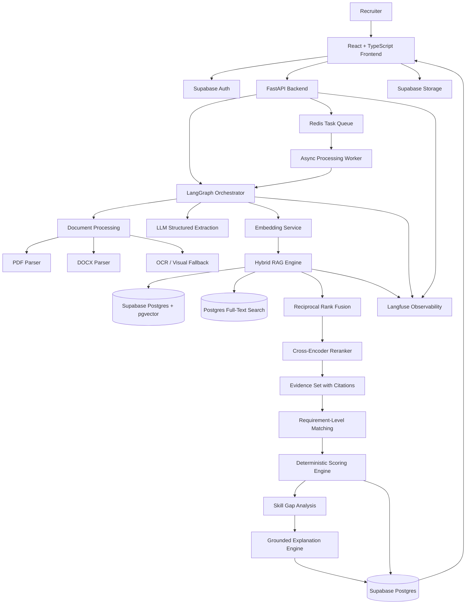

# AI Recruitment & Candidate Intelligence Platform

> **An enterprise-grade, retrieval-augmented candidate matching platform combining structured document intelligence, hybrid semantic/lexical retrieval, skill-graph normalization, evidence reranking, deterministic scoring, and grounded LLM explanations.**

[](https://www.python.org/)
[](https://fastapi.tiangolo.com/)
[](https://react.dev/)
[](https://supabase.com/)
[](https://www.langchain.com/langgraph)
[](https://langfuse.com/)

---

## 📖 Complete Technical Architecture Specification

> **For the comprehensive 1,700+ line technical architecture specification, database schemas, API specs, evaluation matrices, and implementation blueprint, see [docs/ARCHITECTURE.md](docs/ARCHITECTURE.md).**

---

## 🏛️ System Architecture



---

## 💡 Core Engineering Principles

### 1. The LLM Never Decides the Final Score
In naive AI projects, developers dump an entire resume and job description into an LLM prompt and ask: *"Give me a candidate match score from 0 to 100."*  
**This fails in production** due to non-determinism, hallucinations, lack of auditability, and regulatory bias.

In this platform:
- **Hybrid RAG** retrieves grounded, verifiable evidence chunks from the resume.
- A **Deterministic Scoring Engine** calculates mathematical category scores using configurable weights.
- The **LLM** is strictly reserved for structured information extraction and generating explainable, cited justifications based solely on verified facts.

```
                  ┌───────────────────────────────┐
                  │    LLM Structured Parser      │
                  └──────────────┬────────────────┘
                                 │
                                 ▼
                  ┌───────────────────────────────┐
                  │   Hybrid Retrieval (VEC+FTS)  │
                  └──────────────┬────────────────┘
                                 │
                                 ▼
                  ┌───────────────────────────────┐
                  │  Deterministic Scoring Engine │
                  └──────────────┬────────────────┘
                                 │
                                 ▼
                  ┌───────────────────────────────┐
                  │ Grounded Explanations w/ Page │
                  │          Citations            │
                  └───────────────────────────────┘
```

### 2. Requirement-Level Retrieval (Not Document-to-Document)
Instead of embedding an entire 3-page resume into a single vector (which loses critical granular bullet points), the system decomposes a Job Description into discrete atomic requirements (e.g., *"3+ years of FastAPI backend development"*, *"PostgreSQL indexing"*).  
Each requirement initiates an isolated hybrid search query across section-aware candidate chunks.

### 3. Hybrid Semantic + Lexical Retrieval (pgvector + FTS)
- **Vector Search (Cosine Distance via pgvector)**: Identifies semantic relationships (e.g., matching "Python backend" with "FastAPI & Django API architect").
- **Postgres Full-Text Search (`tsvector`)**: Accurately catches exact technical keywords, tool versions, and acronyms (e.g., "K8s", "GCP", "PyTorch 2.0").
- **Reciprocal Rank Fusion (RRF)** & **Cross-Encoder Reranking**: Combines and reranks retrieved candidates to build the ultimate high-precision evidence set.

---

## 🔄 The Three Core Pipelines

### Pipeline A — Job Intelligence
Deconstructs raw job descriptions (text or file upload) into validated structured requirements:
1. Document ingestion and text validation.
2. Structured extraction into Pydantic models via Gemini.
3. Canonical skill normalization (mapping "Postgres" → "PostgreSQL").
4. Requirement chunk embedding generation.
5. Indexing in PostgreSQL with pgvector and full-text search vectors.

### Pipeline B — Candidate Intelligence
Transforms unstructured candidate resumes into structured, queryable profiles:
1. Secure upload to Supabase private storage.
2. Section-aware text parsing (Experience, Education, Projects, Skills).
3. Structured profile extraction and Pydantic validation.
4. Section-level chunking tagged with metadata (page number, company, role, section).
5. Vector embedding generation and database indexing.

### Pipeline C — Matching & Intelligence
1. Requirement-by-requirement hybrid retrieval.
2. Reciprocal Rank Fusion (RRF) and Cross-Encoder reranking.
3. Evidence aggregation with page and section citations.
4. Deterministic category scoring:
   $$\text{Final Score} = 0.40 \cdot S_{\text{skills}} + 0.25 \cdot S_{\text{exp}} + 0.20 \cdot S_{\text{proj}} + 0.10 \cdot S_{\text{edu}} + 0.05 \cdot S_{\text{add}}$$
5. Automated skill-gap analysis.
6. Grounded explanation generation with verifiable evidence citations.

---

## 🛠️ Technology Stack

| Layer | Technology | Rationale |
|---|---|---|
| **Frontend** | React, Vite, TypeScript, Vanilla CSS | Fast, responsive UI with recruiter dashboard, candidate ranking, and evidence view. |
| **API & Backend** | Python 3.11+, FastAPI, Pydantic v2 | High-performance asynchronous API framework with native OpenAPI and type safety. |
| **Orchestration** | LangGraph | Deterministic state machine managing multi-step ingestion and matching workflows. |
| **LLM & Extraction** | Google Gemini (1.5 Flash / Pro) | Structured JSON outputs, large context window, and high-quality grounded reasoning. |
| **Embeddings** | Gemini Embeddings (`text-embedding-004`) | High-dimensional semantic representation for requirement and chunk matching. |
| **Database & Vectors** | Supabase (PostgreSQL + pgvector + FTS) | Unified database hosting relational tables, HNSW vector indexes, and lexical search in one platform. |
| **Storage & Auth** | Supabase Storage & Supabase Auth | Private S3-compatible document storage and Row-Level Security (RLS) multi-tenancy. |
| **Async Processing** | Redis + Background Workers | Non-blocking resume batch ingestion and background embedding generation. |
| **Observability** | Langfuse | Complete trace observability, latency tracking, token usage, and evaluation metrics. |

---

## 📂 Repository Structure

```text
ai-recruitment-platform/
├── docs/
│   ├── ARCHITECTURE.md          # Complete 1,700+ line technical architecture specification
│   └── architecture.mmd         # Standalone Mermaid diagram
├── backend/
│   ├── app/
│   │   ├── api/                 # REST API endpoints (jobs, candidates, resumes, matches)
│   │   ├── core/                # App config, database connections, environment settings
│   │   ├── models/              # SQLAlchemy / SQLModel database entities
│   │   ├── schemas/             # Pydantic validation schemas
│   │   ├── services/            # Extraction, RAG, scoring, and matching services
│   │   ├── workflows/           # LangGraph orchestration state machines
│   │   └── utils/               # PDF/DOCX extractors, text parsers, helpers
│   └── tests/                   # Pytest suite (unit, integration, and eval tests)
├── frontend/
│   ├── src/
│   │   ├── components/          # UI components (EvidencePanel, ScoreBreakdown, etc.)
│   │   ├── pages/               # Dashboard, JobDetails, CandidateView
│   │   └── services/            # API client service integration
├── data/                        # Local mock data & samples (gitignored)
└── samples/                     # Test resumes and job descriptions for evaluation
```

---

## 🗺️ Engineering Roadmap

- [x] **Stage 1: Foundation** — SQLite/Postgres baseline database schema and basic FastAPI endpoints.
- [ ] **Stage 2: Supabase & Vector Storage** — Supabase integration with pgvector, HNSW indexing, and storage buckets.
- [ ] **Stage 3: Document Processing** — PyMuPDF / docx extraction with section detection and fallback OCR.
- [ ] **Stage 4: Structured Intelligence** — Gemini structured extraction with Pydantic validation and Skill Graph normalization.
- [ ] **Stage 5: Hybrid RAG & Reranking** — pgvector + FTS hybrid search, RRF, and cross-encoder reranking.
- [ ] **Stage 6: Matching & Deterministic Scoring** — Requirement-level matching, weighted scoring engine, and skill-gap identification.
- [ ] **Stage 7: Grounded Explanations** — Evidence citation generator mapping claims to page numbers and document sections.
- [ ] **Stage 8: LangGraph & Async Workers** — LangGraph state machine orchestrating batch processing via Redis.
- [ ] **Stage 9: Observability & Evals** — Langfuse tracing, retrieval recall metrics, and CI/CD automated test harness.

---

## 📄 License & Attribution
Designed and developed as an open architecture blueprint for next-generation AI recruitment and candidate intelligence systems.
