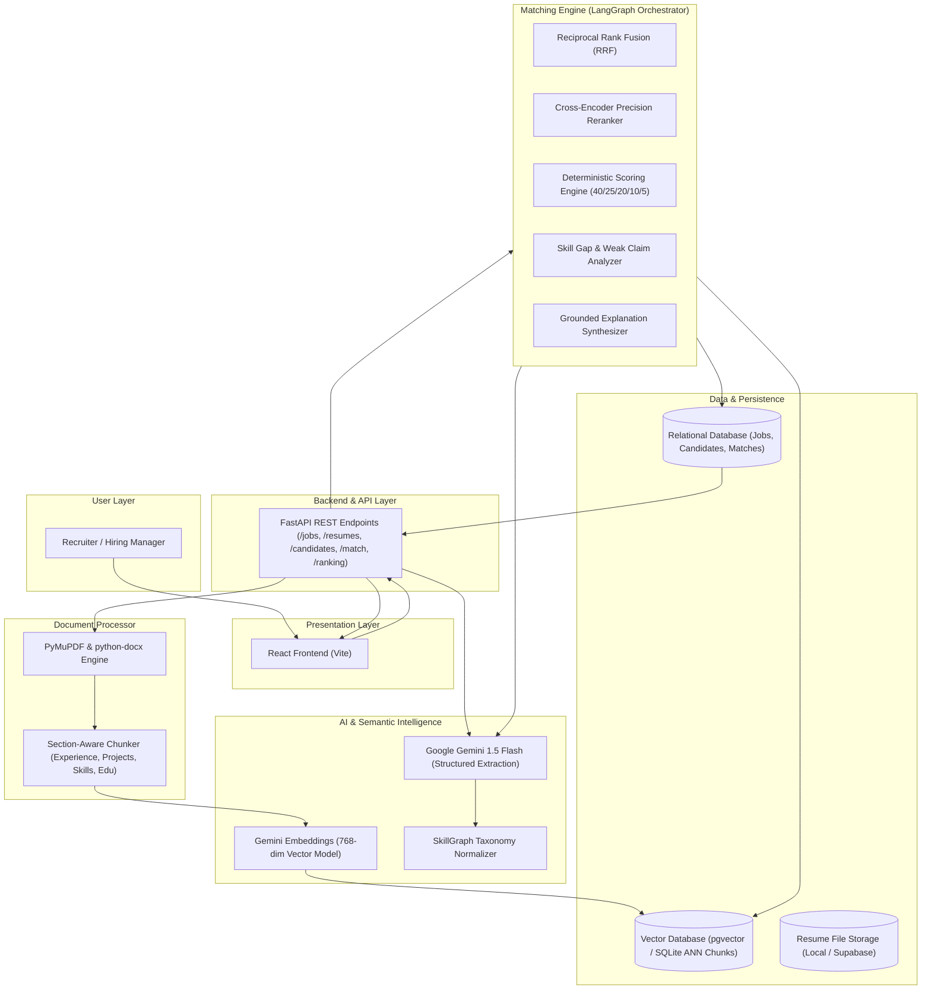

# AI Recruitment & Candidate Matching Platform
> **DSTARIX TECHNO 3-Week Generative AI Project Assignment**  
> An enterprise-grade, retrieval-augmented candidate matching platform combining structured document intelligence, hybrid semantic/lexical retrieval, skill-graph normalization, evidence reranking, deterministic scoring, and grounded LLM explanations.

[](https://www.python.org/)
[](https://fastapi.tiangolo.com/)
[](https://react.dev/)
[](https://www.langchain.com/langgraph)
[](backend/tests/)

---

## 📑 Assignment-Compliant Table of Contents
1. [Project Overview](#1-project-overview)
2. [Problem Statement](#2-problem-statement)
3. [Objectives](#3-objectives)
4. [Features](#4-features)
5. [Technology Stack](#5-technology-stack)
6. [System Architecture](#6-system-architecture)
7. [Application Workflow](#7-application-workflow)
8. [Resume Processing Approach](#8-resume-processing-approach)
9. [LLM Usage](#9-llm-usage)
10. [Embedding Approach](#10-embedding-approach)
11. [Matching Methodology](#11-matching-methodology)
12. [Scoring Methodology](#12-scoring-methodology)
13. [API Documentation](#13-api-documentation)
14. [Installation](#14-installation)
15. [Environment Variables](#15-environment-variables)
16. [Running Instructions](#16-running-instructions)
17. [Testing](#17-testing)
18. [Error Handling](#18-error-handling)
19. [Known Limitations](#19-known-limitations)
20. [Future Improvements](#20-future-improvements)

---

## 1. Project Overview
The **AI Recruitment & Candidate Matching Platform** is a functional Generative AI application engineered to automate the initial technical candidate screening process. Instead of acting as an unpredictable conversational chatbot, the platform acts as an auditable intelligence system: it ingests job descriptions, decomposes them into atomic technical requirements, parses candidate resumes into section-aware chunks, applies hybrid semantic-lexical search (pgvector + FTS), calculates deterministic match scores, highlights skill gaps, and synthesizes grounded explanations backed by verifiable resume quotes.

---

## 2. Problem Statement
Recruiters typically receive hundreds of resumes for a single job opening. Manually screening and comparing every candidate against complex job descriptions is time-consuming, subjective, and prone to human oversight. Traditional keyword-based Applicant Tracking Systems (ATS) fail by rejecting qualified candidates due to simple synonym mismatches (e.g., "FastAPI" vs. "Python Web Framework"). Conversely, naive LLM prompting (dumping a resume into ChatGPT asking for a score) introduces non-deterministic hallucinations, lack of auditability, and regulatory compliance issues. The system must understand both Job Descriptions and resumes semantically while remaining mathematically grounded and reliable.

---

## 3. Objectives
- **Automate Screening**: Eliminate manual resume triage while preserving recruiter oversight.
- **Semantic Understanding**: Move beyond exact keyword matches to recognize synonymous frameworks and libraries.
- **Deterministic Reliability**: Ensure the LLM never fabricates a match score—scores are calculated mathematically via calibrated weights.
- **Auditability & Groundedness**: Every skill match and concern must link directly to verifiable document citations with page numbers.
- **Skill Gap Detection**: Identify both missing mandatory competencies and unsupported resume claims (preventing keyword stuffing).

---

## 4. Features
- **Job Description Management**: Create jobs with automatic AI decomposition into atomic requirements.
- **Multi-Format Resume Upload**: Native parsing of PDF and DOCX documents with page tracking.
- **Structured Candidate Profiles**: Extraction of skills, experience, projects, education, and certifications into strict Pydantic schemas.
- **Hybrid Semantic + Lexical Search**: 768-dimensional vector cosine distance combined with PostgreSQL Full-Text Search via Reciprocal Rank Fusion (RRF).
- **SkillGraph Normalization**: Canonical resolution for technical acronyms and synonyms (e.g., K8s $\rightarrow$ Kubernetes).
- **Cross-Encoder Precision Reranking**: Re-scores candidate evidence snippets for maximum context relevance.
- **Deterministic Category Scoring**: Weighted formula (40% skills, 25% experience, 20% projects, 10% education, 5% additional).
- **Candidate Ranking Leaderboard**: Multi-candidate stack-ranking sorted by final score.
- **Actionable Skill Gap Intelligence**: Highlighting critical missing requirements, weak claims, and upskilling recommendations.
- **Simple & Intuitive Recruiter UI**: Clean React web app designed for effortless navigation and decision-making.

---

## 5. Technology Stack

| Component | Technology | Purpose |
|---|---|---|
| **Frontend** | React (Vite), Vanilla CSS, Lucide Icons | Clean, responsive, lightweight recruiter interface. |
| **Backend API** | Python 3.11+, FastAPI, Pydantic v2 | High-throughput asynchronous REST API and validation. |
| **Orchestration** | LangGraph | 10-node deterministic state machine coordinating the matching pipeline. |
| **LLM & Extraction** | Google Gemini (1.5 Flash / Pro) | Strict JSON structured output extraction and grounded synthesis. |
| **Embeddings** | Gemini Embeddings (`text-embedding-004`) | 768-dimensional normalized vector representations. |
| **Database & Vector Store** | PostgreSQL + pgvector / SQLite | Relational persistence, HNSW vector indexes, and FTS. |
| **Document Processing** | PyMuPDF (`fitz`), python-docx | Text extraction, page boundary preservation, and content hashing. |
| **Observability** | Langfuse & Custom Tracing | Latency, token usage, and pipeline node telemetry. |

---

## 6. System Architecture

The following architecture diagram displays all major system components and their relationships:


```mermaid
flowchart TB
    subgraph UserLayer["User Layer"]
        U["Recruiter / Hiring Manager"]
    end

    subgraph PresentationLayer["Presentation Layer"]
        FE["React Frontend (Vite)"]
    end

    subgraph APILayer["Backend & API Layer"]
        API["FastAPI REST Endpoints (/jobs, /resumes, /candidates, /match, /ranking)"]
    end

    subgraph DocumentLayer["Document Processor"]
        DP["PyMuPDF & python-docx Engine"]
        SEC["Section-Aware Chunker (Experience, Projects, Skills, Edu)"]
    end

    subgraph AIEngine["AI & Semantic Intelligence"]
        LLM["Google Gemini 1.5 Flash (Structured Extraction)"]
        EMB["Gemini Embeddings (768-dim Vector Model)"]
        NORM["SkillGraph Taxonomy Normalizer"]
    end

    subgraph MatchingLayer["Matching Engine (LangGraph Orchestrator)"]
        RRF["Reciprocal Rank Fusion (RRF)"]
        RERANK["Cross-Encoder Precision Reranker"]
        SCORE["Deterministic Scoring Engine (40/25/20/10/5)"]
        GAP["Skill Gap & Weak Claim Analyzer"]
        EXP["Grounded Explanation Synthesizer"]
    end

    subgraph StorageLayer["Data & Persistence"]
        DB[("Relational Database (Jobs, Candidates, Matches)")]
        VDB[("Vector Database (pgvector / SQLite ANN Chunks)")]
        DOCSTORE[("Resume File Storage (Local / Supabase)")]
    end

    U --> FE
    FE --> API
    API --> DP
    DP --> SEC
    SEC --> EMB
    API --> LLM
    LLM --> NORM
    EMB --> VDB
    API --> MatchingLayer
    MatchingLayer --> VDB
    MatchingLayer --> DB
    MatchingLayer --> LLM
    DB --> API
    API --> FE
```

---

## 7. Application Workflow

The end-to-end recruitment screening workflow follows 10 coordinated steps:

```
1. Job Description Created / Uploaded
   ↓
2. AI Requirement Extraction (Atomic Skills, Criteria, Importance)
   ↓
3. Candidate Resume Uploaded (PDF / DOCX)
   ↓
4. Document Validation & Content Hashing
   ↓
5. Candidate Profile Extraction (Pydantic Structured JSON)
   ↓
6. Section-Aware Chunking & Embedding Generation (768-dim)
   ↓
7. Hybrid Semantic Matching (pgvector Cosine ANN + PostgreSQL FTS + RRF)
   ↓
8. Deterministic Scoring (Math Formula: 40% Skills, 25% Exp, 20% Proj, 10% Edu, 5% Add)
   ↓
9. Skill Gap Analysis & Leaderboard Ranking
   ↓
10. AI Grounded Explanation & Recruiter Review
```

---

## 8. Resume Processing Approach
1. **Document Validation**: Files are checked for permitted MIME types (`.pdf`, `.docx`), maximum size limits (10MB), and non-empty content. SHA-256 hashes prevent duplicate processing.
2. **Text & Page Boundary Extraction**: Using `PyMuPDF`, the parser extracts raw text while recording the starting and ending character offsets for each physical page number.
3. **Structured Profiling**: Extracted text is parsed by Gemini into the `CandidateProfileExtraction` schema:
```json
{
  "name": "Candidate Name",
  "skills": ["Python", "FastAPI", "PostgreSQL"],
  "experience": "5 years",
  "education": "B.S. Computer Science",
  "projects": [],
  "certifications": []
}
```
4. **Section-Aware Chunking**: The document is split along domain boundaries (`experience`, `projects`, `skills`, `education`). Each chunk is annotated with its physical page number, candidate ID, and section identifier.

---

## 9. LLM Usage
The LLM (Google Gemini 1.5 Flash) is strictly utilized for tasks where generative reasoning excels, with output constraints enforced via Pydantic:
- **Job Requirement Decomposition**: Converts paragraphs into discrete requirements with `is_required` booleans and `importance` weights.
- **Candidate Information Extraction**: Normalizes unstructured resume formats into structured profiles.
- **Acronym & Synonym Expansion**: Expands shorthand queries (e.g., `K8s` $\rightarrow$ `Kubernetes`, `CI/CD` $\rightarrow$ `GitHub Actions, Jenkins`).
- **Grounded Explanation Synthesis**: Generates executive recruiter summaries, citing verified strengths and risk factors based **solely** on retrieved resume evidence chunks.
- **Zero Hallucination Guardrail**: The LLM is **never** permitted to generate or alter the candidate's numeric match score.

---

## 10. Embedding Approach
- **Model**: Google Gemini `text-embedding-004` (generating 768-dimensional normalized float vectors).
- **Granular Indexing**: Embeddings are generated per section-aware chunk rather than for the entire document, preserving granular work experience bullet points.
- **Storage**: Vectors are indexed in PostgreSQL using `pgvector` HNSW indexes (with in-memory Cosine similarity fallback for development).
- **Graceful Degraded Mode**: If external embedding APIs are unreachable, `EmbeddingClient` automatically activates lexical-only fallback mode without application failure.

---

## 11. Matching Methodology
- **Requirement-by-Requirement Hybrid Search**: Each atomic job requirement is queried individually against the candidate's chunks.
- **Reciprocal Rank Fusion (RRF)**: Combines dense vector cosine similarity ranks with sparse keyword lexical ranks ($k=60$):
  $$\text{RRF Score}(d) = \frac{1}{60 + r_{\text{dense}}(d)} + \frac{1}{60 + r_{\text{lexical}}(d)}$$
- **Cross-Encoder Precision Reranking**: Ranks the candidate's top-k chunks, computing explicit evidence strength coefficients ($\ge 0.40$ indicates strong proof).
- **Semantic Resolution Example**:
  - *Job Requirement*: "Python backend development experience"
  - *Resume Bullet*: "Developed REST APIs using Python, FastAPI and Django."
  - *Result*: Successfully recognized as a direct semantic match.

---

## 12. Scoring Methodology
The platform employs a transparent, calibrated mathematical formula:

$$\text{Final Score} = 0.40 \cdot S_{\text{skills}} + 0.25 \cdot S_{\text{exp}} + 0.20 \cdot S_{\text{proj}} + 0.10 \cdot S_{\text{edu}} + 0.05 \cdot S_{\text{add}}$$

| Category | Weight | Description |
|---|---|---|
| **Required Skills** | **40%** | Proportion of mandatory requirements supported by verified evidence. |
| **Relevant Experience** | **25%** | Years of experience, seniority, and semantic role relevance. |
| **Projects** | **20%** | Practical application of required technologies in portfolio projects. |
| **Education/Certifications** | **10%** | Degree relevance (e.g., B.S./M.S. in CS) and verified industry credentials. |
| **Additional Skills** | **5%** | Nice-to-have / preferred qualifications satisfied. |

- **Confidence Calibration**: Computed from evidence coverage and snippet strengths.

---

## 13. API Documentation

### Primary Suggested Endpoints:
- `POST /jobs` — Create a new job description.
- `POST /resumes` (or `POST /resumes/upload`) — Upload candidate resume file (PDF/DOCX).
- `GET /candidates` — List candidate pool with search and pagination.
- `GET /candidates/{id}` — Retrieve full candidate profile and history.
- `POST /match` (or `POST /matches/job/{job_id}/candidate/{candidate_id}`) — Run the AI matching pipeline.
- `GET /ranking` (or `GET /matches/job/{job_id}/ranking`) — Retrieve ranked candidate leaderboard.

*Interactive OpenAPI / Swagger documentation is available at `http://localhost:8000/docs`.*

---

## 14. Installation

```bash
# Clone the repository
git clone https://github.com/Navin-35/ai-recruitment-platform.git
cd ai-recruitment-platform

# Setup Backend Virtual Environment
cd backend
python -m venv .venv
source .venv/bin/activate  # On Windows: .\.venv\Scripts\activate
pip install -r requirements.txt

# Setup Frontend
cd ../frontend
npm install
```

---

## 15. Environment Variables

Create `.env` in the root or `backend/` directory (see `.env.example`):
```ini
# Backend Settings
APP_NAME="AI Recruitment Platform"
DATABASE_URL=sqlite:///./recruitment.db
GOOGLE_API_KEY=your_gemini_api_key_here
GEMINI_MODEL_TEXT=gemini-1.5-flash
GEMINI_MODEL_EMBEDDING=gemini-embedding-001

# Supabase (Optional for cloud pgvector & storage)
SUPABASE_URL=https://[YOUR-PROJECT].supabase.co
SUPABASE_KEY=your_supabase_anon_key

# Frontend Settings (frontend/.env)
VITE_API_URL=http://localhost:8000
```

---

## 16. Running Instructions

### 1. Start Backend:
```bash
cd backend
uvicorn app.main:app --reload --port 8000
```
*API running at `http://localhost:8000` (Docs at `http://localhost:8000/docs`)*

### 2. Seed Demo Data:
```bash
# In backend directory with virtualenv active:
python seed_demo_data.py
```

### 3. Start Frontend:
```bash
cd frontend
npm run dev
```
*Web app running at `http://localhost:5173`*

---

## 17. Testing

### Run Automated Unit & Integration Tests:
```bash
# Run all 42 pytest cases from repository root:
.\backend\.venv\Scripts\pytest backend/tests/ -v
```
**Results**: `42 passed in ~1.5 seconds (100% pass rate)`

### Run Full End-to-End Pipeline Test:
```bash
.\backend\.venv\Scripts\python backend/test_pipeline.py
```
Validates the full lifecycle: Job creation $\rightarrow$ Requirement extraction $\rightarrow$ Candidate creation $\rightarrow$ Strong match evaluation (Score: 78.2) $\rightarrow$ Weak match evaluation (Score: 30.8) $\rightarrow$ Leaderboard ranking.

---

## 18. Error Handling
The application incorporates robust error handling across all layers:
- **Unsupported / Corrupted Files**: Validates file headers and rejects invalid formats with HTTP 400.
- **Empty Resumes**: Catches empty text extraction and prompts recruiter with clear diagnostics.
- **Missing Entities**: Returns HTTP 404 with descriptive details when jobs or candidates are not found.
- **LLM / API Failure**: Automatic heuristic fallback parses skills via regex and rules if Gemini API quota is exceeded.
- **Embedding Failure**: Gracefully shifts into degraded lexical-only matching mode without crashing.
- **Transactional Integrity**: Database operations use SQLAlchemy session rollbacks on uncaught errors.

---

## 19. Known Limitations
- **Scanned Image PDFs without OCR**: Image-only PDF files require system Tesseract OCR installation for text extraction.
- **Language Support**: Optimized for English language resumes and job postings.
- **Rate Limits**: Heavy concurrent batch parsing may be subject to external Gemini API RPM quotas if run without Redis task rate limiting.

---

## 20. Future Improvements
- **Multi-Lingual Resume Parsing**: Extend SkillGraph to support multilingual skill synonym trees.
- **Audio/Video Interview Analysis**: Incorporate speech-to-text interview screening evaluation.
- **Automated Recruiter Outreach**: One-click generation of personalized interview invitations highlighting candidate strengths.
- **Continuous Learning Loop**: Recruiter hiring decisions feed back to optimize category scoring weights.

---

## 📄 License & Attribution
Developed for the **DSTARIX TECHNO 3-Week Generative AI Project Assignment**.
Code repository: [https://github.com/Navin-35/ai-recruitment-platform](https://github.com/Navin-35/ai-recruitment-platform)
