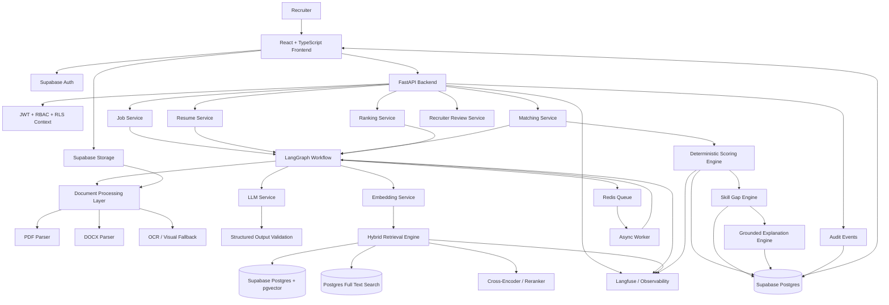
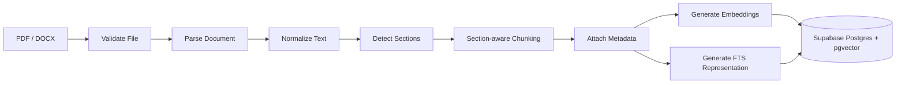
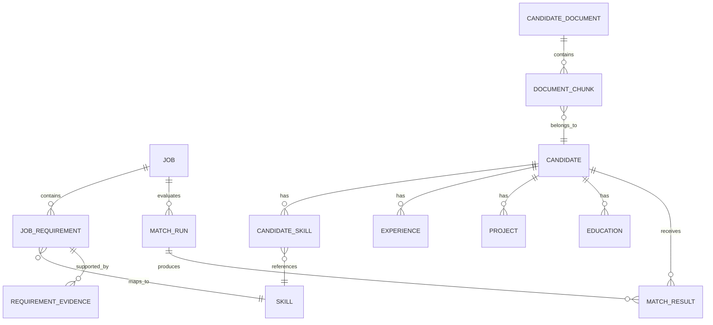
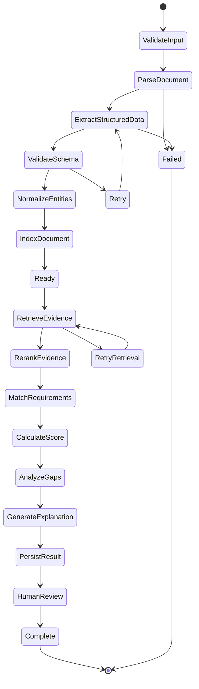
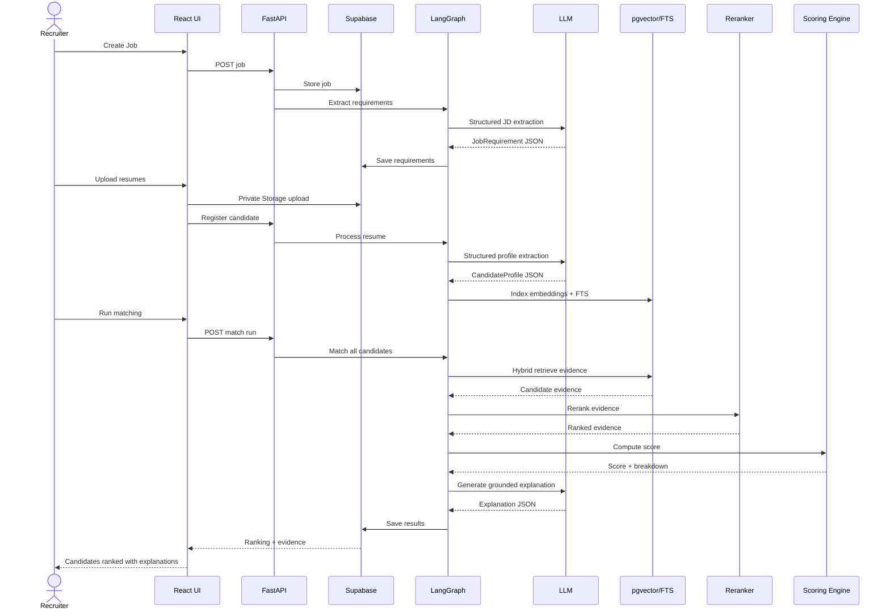

# AI Recruitment & Candidate Matching Platform
## Advanced RAG + Supabase + FastAPI Architecture Blueprint

> Purpose: transform the 3-week assignment into a production-style AI engineering project that is explainable, testable, secure, and strong as a portfolio/resume project.

---

## 1. What the assignment actually requires

The system is not supposed to be a chatbot. It must ingest job descriptions and resumes, extract structured information, semantically match candidates to requirements, calculate scores, rank candidates, detect skill gaps, and generate explanations.

The required technical areas are:

- PDF/DOCX document processing
- text extraction and validation
- LLM-based information extraction
- structured outputs
- embeddings / semantic matching
- candidate scoring and ranking
- skill-gap analysis
- FastAPI or equivalent backend
- error handling
- testing
- clean modular code
- GitHub + documentation + architecture + demo

The assignment's example scoring model is:

| Category | Baseline weight |
|---|---:|
| Required skills | 40% |
| Relevant experience | 25% |
| Projects | 20% |
| Education / certifications | 10% |
| Additional skills | 5% |

These values should be configurable rather than hard-coded.

---

## 2. Core design principle

### Do NOT build this as:

`Resume -> LLM -> score -> explanation`

That architecture is difficult to trust, debug, test, and explain.

### Build this as:

`Documents -> structured intelligence -> retrieval -> evidence -> deterministic scoring -> ranking -> grounded explanation`

The LLM handles language understanding and generation.

The retrieval layer finds evidence.

The matching engine computes semantic and structural similarity.

The scoring engine owns the final numeric score.

The explanation layer is grounded in the evidence and score breakdown.

This separation is the key architectural decision.

---

# 3. Recommended technology stack

## Frontend

- React + Vite
- TypeScript
- Tailwind CSS
- shadcn/ui
- TanStack Query
- Recharts for score/ranking visualizations
- Supabase Auth client

## API / Backend

- Python 3.12+
- FastAPI
- Pydantic v2
- SQLAlchemy 2.x or Supabase Postgres client
- Alembic if using SQLAlchemy migrations

## Workflow orchestration

- LangGraph for the multi-step AI workflow
- Typed state objects between nodes
- retries and conditional branches
- optional human-review checkpoint

## Document processing

Primary:

- PyMuPDF for reliable PDF text extraction
- python-docx for DOCX

Advanced / fallback:

- Unstructured or Docling for layout-aware partitioning
- OCR fallback for scanned PDFs
- LLM document understanding for difficult visual documents

## LLM

Recommended primary provider for this implementation:

- Google Gemini API because it supports JSON-schema structured outputs and modern embedding capabilities.

Keep the LLM layer behind a provider interface so the application can swap Gemini/OpenAI later.

## Embeddings

Recommended:

- Gemini Embedding 2 for text/document embeddings
- choose 768 or 1536 dimensions initially to reduce vector storage and latency

Alternative:

- a sentence-transformer/BGE embedding model hosted locally

## Vector + relational database

- Supabase Postgres
- pgvector extension
- PostgreSQL full-text search (`tsvector`)
- HNSW vector index
- GIN index for full-text search
- SQL/RLS for authorization

## File storage

- Supabase Storage
- private buckets for resumes and job-description files
- database stores file metadata, not large binary documents

## Async processing

Recommended for production-style behavior:

- Redis
- Celery or another queue worker

The API should acknowledge an upload quickly and allow document processing to continue asynchronously.

## Observability / evaluation

- Langfuse for LLM tracing, prompt versions, evaluations, dataset experiments, latency/cost tracking
- OpenTelemetry-compatible application logs/metrics if desired

## Deployment

Simple portfolio deployment:

- Frontend: Vercel
- FastAPI: Render/Railway/Fly.io or a small cloud container
- Redis: managed Redis
- Supabase: hosted Postgres + Storage + Auth
- Langfuse: cloud or self-hosted

More advanced production path:

- Docker
- GitHub Actions CI/CD
- cloud container service
- managed Redis
- secrets manager

---

# 4. Final target architecture



---

# 5. End-to-end user workflow

## Phase A - recruiter creates a job

1. Recruiter signs in.
2. Recruiter creates or uploads a Job Description.
3. File is stored in a private Supabase Storage bucket.
4. A `job` row is created in Postgres.
5. Backend creates a processing job.
6. Document processor extracts text and structural metadata.
7. LLM converts the JD into a strict schema.
8. Requirements are normalized into atomic requirements.
9. Skills are mapped to canonical skill records.
10. Requirement chunks are embedded.
11. Requirement vectors and FTS text are indexed.
12. The job becomes `READY`.

## Phase B - recruiter uploads candidates

1. Recruiter uploads one or many resumes.
2. Files go to private Supabase Storage.
3. File metadata is stored in Postgres.
4. A content hash prevents accidental duplicate ingestion.
5. The processing queue receives the resume ID.
6. Resume text is extracted.
7. Sections are detected: summary, skills, experience, projects, education, certifications, etc.
8. LLM converts the resume into a strict candidate schema.
9. Skills are normalized to canonical skills.
10. Resume sections are chunked using section-aware logic.
11. Chunks get embeddings and FTS representations.
12. Candidate profile and vector index are marked ready.

## Phase C - matching

For every job requirement:

1. Convert the requirement into a retrieval query.
2. Apply metadata filters for the candidate/job scope.
3. Run dense vector search.
4. Run keyword/full-text search.
5. Combine the result lists using Reciprocal Rank Fusion.
6. Rerank the top evidence chunks.
7. Extract evidence strength.
8. Compare the evidence against required/optional status.
9. Compute requirement-level match.
10. Aggregate requirement scores into category scores.
11. Produce a deterministic final score.

## Phase D - explanation

The explanation model receives:

- job requirements
- candidate structured profile
- score breakdown
- matching evidence
- missing/weak skills
- confidence/coverage metadata

It must explain *why* the score was produced and cite the resume evidence used.

## Phase E - ranking

1. Store a matching run.
2. Store every candidate's category scores.
3. Store final score.
4. Rank candidates for the selected job.
5. Preserve the scoring version so historical results remain reproducible.

---

# 6. Advanced RAG architecture

This project should use RAG for **evidence retrieval**, not as a replacement for matching logic.

## 6.1 Ingestion pipeline



## 6.2 Section-aware chunking

Do not blindly split every resume into fixed 500-token chunks.

Use logical chunks such as:

- `summary`
- `skills`
- `experience.company.role`
- `experience.project`
- `project`
- `education`
- `certification`
- `achievement`

Metadata example:

```json
{
  "tenant_id": "...",
  "job_id": "...",
  "candidate_id": "...",
  "document_id": "...",
  "section": "experience",
  "company": "Example Corp",
  "role": "Backend Engineer",
  "chunk_type": "experience_bullet",
  "page": 2,
  "source_hash": "..."
}
```

This allows retrieval to answer questions like:

> Show evidence that this candidate has Python backend experience.

instead of simply:

> Find similar text.

## 6.3 Hybrid retrieval

Run two retrieval channels:

### Semantic

Use pgvector similarity search.

Best for:

- paraphrases
- concept similarity
- related technical descriptions
- differently worded experiences

### Lexical

Use PostgreSQL full-text search.

Best for:

- exact skill names
- acronyms
- certifications
- product/tool names
- rare technologies

Then combine them:

`Hybrid = RRF(vector_results, keyword_results)`

After fusion, rerank the top N candidates using a cross-encoder.

## 6.4 Reranking

A reranker receives:

`query = job requirement`

and

`candidate evidence = retrieved chunk`

It returns a relevance score. This creates a second-stage retrieval system:

`Recall-oriented retrieval -> precision-oriented reranking`

## 6.5 Query expansion

For a requirement such as:

> Python backend development experience

generate retrieval concepts such as:

- Python backend
- REST APIs
- FastAPI
- Django
- Flask
- backend services
- API development

Do not automatically mark the expanded terms as required skills. They are retrieval aids.

## 6.6 Requirement decomposition

Break a job into atomic requirements:

```text
Requirement R1:
  Python backend development

Requirement R2:
  PostgreSQL experience

Requirement R3:
  Docker deployment

Requirement R4:
  2+ years backend experience
```

Each requirement becomes an independently scored retrieval problem.

This is much stronger than embedding the complete JD once.

---

# 7. Lightweight GraphRAG layer

You do not need Neo4j for the first version.

Use relational tables in Supabase/Postgres to model the recruitment graph.



Example graph relationships:

- Candidate -> HAS_SKILL -> Python
- Candidate -> WORKED_WITH -> FastAPI
- Candidate -> BUILT -> REST API
- Job -> REQUIRES -> Python
- Job -> REQUIRES -> REST APIs

This enables structured + semantic matching together.

---

# 8. Candidate data model

Use structured data as the source of truth.

## CandidateProfile

```json
{
  "candidate_id": "uuid",
  "name": "Candidate Name",
  "email": "candidate@example.com",
  "phone": null,
  "summary": "...",
  "skills": [
    {
      "name": "Python",
      "canonical_skill_id": "uuid",
      "confidence": 0.97,
      "evidence_ids": ["chunk-1", "chunk-7"]
    }
  ],
  "experience": [
    {
      "company": "Example Corp",
      "role": "Backend Engineer",
      "start_date": "2024-01",
      "end_date": null,
      "skills_used": ["Python", "FastAPI", "PostgreSQL"],
      "responsibilities": ["..."],
      "evidence_ids": ["chunk-9"]
    }
  ],
  "projects": [],
  "education": [],
  "certifications": []
}
```

Every extracted fact should have an evidence pointer whenever practical.

That makes the UI able to show:

`Python -> verified from Resume page 2 -> Experience section`

instead of showing an unsupported LLM claim.

---

# 9. Database design in Supabase

Recommended tables:

```text
profiles
organizations
jobs
job_documents
job_requirements
skills
skill_aliases
candidates
candidate_documents
candidate_profiles
candidate_skills
candidate_experiences
candidate_projects
candidate_education
candidate_certifications
chunks
generated_embeddings
match_runs
match_results
requirement_matches
skill_gaps
explanations
processing_jobs
audit_events
model_versions
prompt_versions
feedback
```

## Important fields

### jobs

- id
- organization_id
- title
- description
- status
- scoring_config_id
- created_by
- created_at

### candidates

- id
- organization_id
- name
- email
- profile_status
- created_at

### chunks

- id
- document_id
- candidate_id
- job_id nullable
- content
- section
- page_number
- chunk_type
- metadata jsonb
- embedding vector
- search_tsv tsvector
- content_hash
- created_at

### match_results

- id
- match_run_id
- job_id
- candidate_id
- final_score
- rank
- score_breakdown jsonb
- confidence
- explanation_id
- scoring_version

### requirement_matches

- id
- match_result_id
- job_requirement_id
- similarity_score
- rerank_score
- evidence_strength
- match_state
- evidence_chunk_ids

---

# 10. Supabase architecture

Use Supabase for four major responsibilities.

## 10.1 Auth

Recruiter accounts and organization membership.

Roles:

- recruiter
- hiring_manager
- admin

## 10.2 Storage

Private buckets:

```text
resumes/
job-descriptions/
exports/
```

Do not make resume buckets public.

Use RLS policies and signed access for sensitive files.

## 10.3 Postgres

Postgres is the system of record for:

- jobs
- candidates
- structured profiles
- scores
- rankings
- audit records
- retrieval chunks

## 10.4 pgvector

Store chunk embeddings in Postgres and retrieve by similarity.

Use an HNSW index for scalable approximate nearest-neighbor retrieval.

---

# 11. Matching engine

The matching engine should operate at requirement level first.

For each requirement:

```text
Requirement
   |
   +--> exact/normalized skill match
   |
   +--> semantic retrieval
   |
   +--> reranking
   |
   +--> experience evidence
   |
   +--> project evidence
   |
   +--> confidence
   |
   +--> requirement score
```

Example:

```text
Requirement: Docker
Candidate:
  - docker-compose.yml mentioned in project evidence
  - Docker listed in skills
  - internship experience deploying containers

=> strong match
```

But:

```text
Requirement: Kubernetes
Candidate:
  - course certificate mentions Kubernetes
  - no project/work evidence

=> partial / weak match
```

This is more meaningful than binary keyword matching.

---

# 12. Deterministic scoring engine

Keep the final score outside the LLM.

Example configurable equation:

```text
FinalScore =
    0.40 * RequiredSkillScore
  + 0.25 * ExperienceScore
  + 0.20 * ProjectScore
  + 0.10 * EducationCertificationScore
  + 0.05 * AdditionalSkillScore
```

Each component is normalized to 0-100.

## RequiredSkillScore

Combine:

- exact canonical skill coverage
- semantic evidence score
- requirement importance
- evidence strength

Example conceptual form:

```text
skill_score =
  0.50 * coverage
+ 0.30 * semantic_alignment
+ 0.20 * evidence_strength
```

## ExperienceScore

Consider:

- relevant role
- relevant technologies
- duration
- recency
- requirement-specific evidence

## ProjectScore

Consider:

- project similarity
- technologies used
- responsibilities
- measurable outcomes

## EducationCertificationScore

Consider:

- degree requirements
- specialization
- certifications
- relevance

## AdditionalSkillScore

Reward useful skills that are relevant but not mandatory.

---

# 13. Explanation generation

The explanation should be generated only after scoring.

### Input to explanation model

```text
Job requirements
+ candidate profile
+ score breakdown
+ top matching evidence
+ missing requirements
+ confidence
+ retrieval metadata
```

### Output schema

```json
{
  "summary": "...",
  "strengths": [
    {
      "skill": "Python",
      "reason": "...",
      "evidence": ["chunk-1"]
    }
  ],
  "gaps": [
    {
      "skill": "Kubernetes",
      "reason": "...",
      "severity": "medium",
      "evidence": ["chunk-12"]
    }
  ],
  "experience_analysis": "...",
  "recommendation_notes": "..."
}
```

The LLM should not invent evidence.

If an explanation cannot be supported by retrieved evidence, it should say that evidence is insufficient.

---

# 14. LangGraph workflow



### Why LangGraph

Use explicit nodes rather than one giant agent prompt.

Each node has:

- input state
- output state
- validation
- retries
- logging
- testability

The workflow becomes explainable in a technical interview.

---

# 15. API design

Core assignment endpoints:

```text
POST /jobs
POST /resumes
GET  /candidates
GET  /candidates/{id}
POST /match
GET  /ranking
```

Recommended expanded API:

```text
POST   /api/v1/jobs
GET    /api/v1/jobs/{job_id}
POST   /api/v1/jobs/{job_id}/documents
POST   /api/v1/jobs/{job_id}/requirements/extract
GET    /api/v1/jobs/{job_id}/requirements

POST   /api/v1/candidates/upload
GET    /api/v1/candidates
GET    /api/v1/candidates/{candidate_id}
GET    /api/v1/candidates/{candidate_id}/documents

POST   /api/v1/matches/runs
GET    /api/v1/matches/runs/{run_id}
GET    /api/v1/jobs/{job_id}/ranking
GET    /api/v1/jobs/{job_id}/candidates/{candidate_id}/match

GET    /api/v1/jobs/{job_id}/skill-gaps
GET    /api/v1/jobs/{job_id}/explanations

POST   /api/v1/feedback
GET    /api/v1/processing/{job_id}

GET    /health
GET    /ready
```

---

# 16. Suggested backend folder structure

```text
backend/
├── app/
│   ├── main.py
│   ├── config.py
│   ├── dependencies.py
│   │
│   ├── api/
│   │   └── v1/
│   │       ├── jobs.py
│   │       ├── candidates.py
│   │       ├── resumes.py
│   │       ├── matches.py
│   │       ├── rankings.py
│   │       ├── feedback.py
│   │       └── health.py
│   │
│   ├── schemas/
│   │   ├── job.py
│   │   ├── candidate.py
│   │   ├── resume.py
│   │   ├── matching.py
│   │   └── explanation.py
│   │
│   ├── models/
│   │   ├── job.py
│   │   ├── candidate.py
│   │   ├── document.py
│   │   ├── chunk.py
│   │   ├── skill.py
│   │   ├── match.py
│   │   └── audit.py
│   │
│   ├── services/
│   │   ├── document_service.py
│   │   ├── extraction_service.py
│   │   ├── embedding_service.py
│   │   ├── retrieval_service.py
│   │   ├── reranking_service.py
│   │   ├── matching_service.py
│   │   ├── scoring_service.py
│   │   ├── ranking_service.py
│   │   ├── skill_gap_service.py
│   │   ├── explanation_service.py
│   │   └── feedback_service.py
│   │
│   ├── ai/
│   │   ├── llm_provider.py
│   │   ├── embedding_provider.py
│   │   ├── prompts.py
│   │   └── structured_outputs.py
│   │
│   ├── workflows/
│   │   ├── ingestion_graph.py
│   │   ├── matching_graph.py
│   │   └── states.py
│   │
│   ├── retrieval/
│   │   ├── hybrid_search.py
│   │   ├── reranker.py
│   │   ├── query_expansion.py
│   │   └── chunking.py
│   │
│   ├── workers/
│   │   ├── celery_app.py
│   │   └── tasks.py
│   │
│   ├── security/
│   │   ├── auth.py
│   │   └── permissions.py
│   │
│   ├── observability/
│   │   └── tracing.py
│   │
│   └── tests/
│       ├── unit/
│       ├── integration/
│       ├── retrieval/
│       └── evals/
│
├── migrations/
├── scripts/
├── requirements.txt
└── .env.example
```

---

# 17. Frontend pages

```text
/login
/dashboard
/jobs
/jobs/new
/jobs/:id
/jobs/:id/candidates
/jobs/:id/ranking
/jobs/:id/candidates/:candidateId
/candidates
/candidates/:id
/settings
```

## Candidate detail page

Show:

1. overall match score
2. category score breakdown
3. matching skills
4. missing/weak skills
5. experience analysis
6. project evidence
7. explanation
8. retrieved evidence snippets
9. source page/section references
10. confidence

The page should allow the recruiter to inspect the evidence that produced the result.

---

# 18. Error handling architecture

Every pipeline stage should have a predictable failure state.

```text
RECEIVED
  -> VALIDATING
  -> PARSING
  -> EXTRACTING
  -> NORMALIZING
  -> EMBEDDING
  -> INDEXING
  -> READY
```

Failure states:

```text
INVALID_FILE
UNSUPPORTED_FORMAT
EMPTY_DOCUMENT
CORRUPTED_DOCUMENT
EXTRACTION_FAILED
SCHEMA_VALIDATION_FAILED
EMBEDDING_FAILED
LLM_FAILED
INDEXING_FAILED
MATCHING_FAILED
```

Each processing job should record:

- status
- stage
- attempt number
- error code
- user-facing message
- internal diagnostic message
- timestamp
- retryable flag

---

# 19. Testing strategy

The assignment explicitly asks for testing multiple scenarios.

Build a real evaluation dataset.

## Document tests

- valid PDF
- valid DOCX
- scanned PDF
- empty file
- corrupted file
- unsupported file
- incomplete resume
- unusual formatting

## Semantic retrieval tests

Create examples such as:

```text
JD: Python backend development
Resume: Built REST APIs with FastAPI and Django
Expected: strong retrieval
```

```text
JD: Kubernetes
Resume: Docker and AWS only
Expected: weak/no direct evidence
```

## Matching tests

- strong candidate
- partial candidate
- weak candidate
- semantic paraphrase
- exact keyword only
- multiple candidates
- no matching candidates

## LLM tests

- malformed structured response
- API timeout
- rate limit
- schema validation failure
- hallucination guard

---

# 20. RAG evaluation metrics

Do not only evaluate the final answer.

Evaluate the retrieval layer separately.

## Retrieval

- Recall@K
- Precision@K
- MRR
- nDCG@K

## Extraction

- field-level precision/recall/F1 where labels are available
- schema validity rate

## Matching

- ranking agreement against labeled examples
- score calibration
- false-positive rate for required skills
- false-negative rate for required skills

## Explanation

Evaluate:

- evidence grounding
- citation correctness
- unsupported-claim rate
- completeness of strengths/gaps

## System

Track:

- latency
- LLM token usage
- cost per resume
- failure rate
- retrieval latency
- queue time

---

# 21. Observability

Every match run should have one trace.

Example trace:

```text
match_run
├── load_job
├── load_candidate
├── requirement_decomposition
├── retrieve_requirement_1
│   ├── vector_search
│   ├── keyword_search
│   ├── rrf
│   └── rerank
├── retrieve_requirement_2
├── score_candidate
├── skill_gap_analysis
├── generate_explanation
└── persist_result
```

Store model/prompt versions with each run.

This makes debugging questions answerable:

- Which prompt generated this extraction?
- Which embedding model indexed the candidate?
- Which chunks were retrieved?
- What caused the score to change?
- Which model generated the explanation?

---

# 22. Security design

Recruitment data is sensitive.

Minimum security model:

- Supabase Auth
- private Storage buckets
- Postgres RLS
- organization-level tenant isolation
- recruiter-role permissions
- backend API authorization
- signed file URLs
- never expose service-role keys to the browser
- environment variables for secrets
- audit logs for sensitive actions
- validate file MIME types and size
- sanitize extracted text
- rate limiting on expensive AI endpoints

Tenant key should exist on all organization-owned records:

```text
organization_id
```

RLS should prevent recruiter A from retrieving recruiter B's candidate documents.

---

# 23. Bias / fairness guardrails

Do not use protected or irrelevant attributes for matching.

Avoid scoring based on:

- gender
- race/ethnicity
- religion
- age unless legally/role relevant and explicitly allowed
- marital/family status
- unrelated personal information

Also avoid automatically treating names, photos, addresses, or other demographic proxies as positive/negative signals.

Make the scoring configuration explicit and auditable.

The platform should assist recruiter review rather than silently make hiring decisions.

---

# 24. What makes the project advanced

The differentiating architecture is:

```text
              STRUCTURED EXTRACTION
                       |
                       v
             CANONICAL SKILL GRAPH
                       |
                       v
       HYBRID RAG = VECTOR + KEYWORD
                       |
                       v
                 RERANKING
                       |
                       v
              EVIDENCE COLLECTION
                       |
                       v
          DETERMINISTIC SCORING ENGINE
                       |
                       v
                 SKILL GAPS
                       |
                       v
        GROUNDED EXPLANATION GENERATOR
                       |
                       v
              RECRUITER REVIEW
```

This demonstrates multiple areas of modern AI engineering instead of a single LLM call.

---

# 25. Advanced features to add after the core system works

## A. Conversational recruiter copilot

Example:

> "Show me candidates with strong Python and FastAPI evidence but weak Kubernetes experience."

The copilot converts natural language into structured filters + retrieval + ranking queries.

## B. Explainable evidence panel

Click a score and see the exact resume sections that contributed to it.

## C. Feedback learning loop

Recruiter actions such as:

- shortlisted
- rejected
- moved to interview
- marked irrelevant

can be captured as feedback data.

This can later support ranking evaluation or a learning-to-rank model.

## D. Skill ontology

Map aliases:

```text
Postgres -> PostgreSQL
K8s -> Kubernetes
REST -> REST API
ReactJS -> React
```

Use an alias table plus semantic similarity rather than hard-coded strings only.

## E. Versioned scoring profiles

Different jobs can use different scoring weights.

Example:

```json
{
  "required_skills": 0.45,
  "experience": 0.30,
  "projects": 0.15,
  "education": 0.05,
  "additional": 0.05
}
```

Store the configuration version with every matching run.

## F. Human review checkpoint

Allow recruiter approval/editing of extracted skills before matching.

That demonstrates controlled human-in-the-loop AI.

---

# 26. Recommended implementation order

Do not implement all advanced features at once.

## Stage 1 - foundation

- repository
- FastAPI
- React
- Supabase
- Auth
- jobs table
- candidates table
- Storage
- basic upload

## Stage 2 - document intelligence

- PDF/DOCX extraction
- validation
- candidate schema
- job requirement schema
- structured output validation

## Stage 3 - retrieval

- chunking
- embeddings
- pgvector
- full-text search
- hybrid retrieval

## Stage 4 - matching

- requirement decomposition
- evidence retrieval
- reranker
- skill normalization
- requirement-level scoring
- final deterministic score

## Stage 5 - explanation

- grounded explanation
- evidence references
- skill-gap analysis

## Stage 6 - ranking dashboard

- candidate table
- ranking
- filters
- score breakdown
- candidate detail page

## Stage 7 - reliability

- async workers
- retries
- error states
- logging
- audit events

## Stage 8 - AI engineering maturity

- LangGraph workflow
- Langfuse tracing
- prompt versioning
- offline RAG evaluation
- online feedback

## Stage 9 - deployment

- Docker
- CI/CD
- production env variables
- health checks
- monitoring

---

# 27. Suggested GitHub repository structure

```text
ai-recruitment-platform/
├── frontend/
├── backend/
├── infra/
│   ├── docker/
│   └── scripts/
├── database/
│   ├── migrations/
│   └── seed/
├── evals/
│   ├── retrieval/
│   ├── extraction/
│   └── matching/
├── docs/
│   ├── architecture.md
│   ├── api.md
│   ├── rag.md
│   ├── scoring.md
│   └── security.md
├── sample-data/
│   ├── resumes/
│   └── job-descriptions/
├── .github/
│   └── workflows/
├── README.md
├── docker-compose.yml
└── .env.example
```

---

# 28. GitHub workflow for a strong contribution history

Use feature branches and small meaningful commits.

Example:

```text
main
 |
 +-- feature/supabase-foundation
 |
 +-- feature/document-ingestion
 |
 +-- feature/structured-extraction
 |
 +-- feature/hybrid-rag
 |
 +-- feature/matching-engine
 |
 +-- feature/scoring-engine
 |
 +-- feature/ranking-dashboard
 |
 +-- feature/explainability
 |
 +-- feature/evaluation
 |
 +-- feature/observability
 |
 +-- feature/deployment
```

Prefer commit messages such as:

```text
feat: add Supabase schema and RLS policies
feat: implement PDF and DOCX ingestion
feat: add structured candidate extraction
feat: add pgvector hybrid retrieval
feat: add requirement-level matching
feat: add deterministic scoring engine
feat: add skill-gap analysis
feat: add grounded candidate explanations
test: add retrieval evaluation dataset
feat: add Langfuse tracing
chore: add Docker deployment workflow
```

---

# 29. Final demo workflow

The demonstration should follow one complete story:



The live demo should visibly show:

1. create JD
2. upload 5-20 sample resumes
3. processing status
4. extracted job requirements
5. candidate profile cards
6. Run Match
7. ranked candidate list
8. score breakdown
9. matching skills
10. missing skills
11. evidence snippets
12. AI explanation
13. error handling example
14. architecture explanation

---

# 30. Resume-level project description

Use a description along these lines after the system is actually implemented:

> Built a production-style AI recruitment and candidate matching platform using FastAPI, React, Supabase Postgres/pgvector, hybrid RAG, structured LLM extraction, semantic reranking, and LangGraph workflows. Developed a requirement-level matching engine with configurable deterministic scoring, skill-gap analysis, evidence-grounded explanations, secure document storage/RLS, asynchronous processing, and RAG/LLM evaluation with observability.

Do not claim features that are not actually implemented.

---

# 31. Interview explanation: 60-second architecture story

> "I designed the platform as a pipeline rather than a chatbot. Resumes and job descriptions are stored securely in Supabase Storage and processed asynchronously. A document pipeline extracts and structures information using schema-constrained LLM outputs. Each document is section-aware chunked and indexed in Supabase Postgres with pgvector plus PostgreSQL full-text search. During matching, every atomic job requirement becomes a retrieval query. I combine dense and lexical retrieval, rerank the evidence, and pass only grounded evidence into a deterministic scoring engine. The final score is calculated outside the LLM using configurable weights, while a separate LLM step generates an explanation tied to retrieved resume evidence. LangGraph orchestrates the workflow and Langfuse traces the AI steps for evaluation, debugging, and prompt/model versioning. This gives me semantic intelligence without making the LLM the source of truth for ranking decisions."

---

# 32. Architecture maturity ladder

## Level 1

LLM + resume parser

## Level 2

Structured extraction + embeddings

## Level 3

Vector DB + semantic matching

## Level 4

Hybrid retrieval + reranking

## Level 5

Deterministic scoring + evidence grounding

## Level 6

Graph/ontology-based skill normalization

## Level 7

LangGraph orchestration + async workers

## Level 8

Evaluation + observability + prompt/model versioning

## Level 9

RLS + multi-tenancy + production deployment

Aim to reach Level 8 or 9 only after Level 1-5 are stable.

---

# 33. Key engineering rules

1. Never let the LLM directly own the final candidate score.
2. Never store secrets in the frontend.
3. Never use only vector search for skills; exact lexical search still matters.
4. Never index an entire resume as one giant vector.
5. Preserve page/section metadata for evidence.
6. Version prompts, embedding models, and scoring configuration.
7. Make every processing stage retryable or explicitly terminal.
8. Store match runs so rankings are reproducible.
9. Build an evaluation dataset before claiming the RAG system works.
10. Make every important AI result inspectable by a recruiter.

---

# 34. Definition of done

The project is complete when a recruiter can:

```text
Login
  -> Create Job
  -> Upload JD
  -> Extract requirements
  -> Upload many resumes
  -> Process documents
  -> Inspect candidate profiles
  -> Run matching
  -> Retrieve evidence
  -> Rerank evidence
  -> Calculate scores
  -> Rank candidates
  -> View skill gaps
  -> Read grounded explanation
  -> Inspect source evidence
  -> Give feedback
```

And the engineering side can demonstrate:

```text
FastAPI
+ Supabase Auth
+ Supabase Storage
+ Postgres
+ pgvector
+ Full-text search
+ Hybrid RAG
+ Reranking
+ Structured outputs
+ LangGraph
+ Async workers
+ Deterministic scoring
+ RLS / security
+ Tests
+ Retrieval evaluation
+ Observability
+ Docker / CI/CD
```

---

# 35. Recommended first implementation milestone

Before writing the full matching algorithm, finish this slice end-to-end:

```text
React upload
      |
      v
Supabase Storage
      |
      v
FastAPI
      |
      v
Document parser
      |
      v
Gemini structured extraction
      |
      v
CandidateProfile in Postgres
      |
      v
Section-aware chunks
      |
      v
Gemini Embedding 2
      |
      v
pgvector + FTS
```

Once this is stable, implement requirement-level retrieval and matching.

That sequencing minimizes rework and gives you a working vertical slice early.