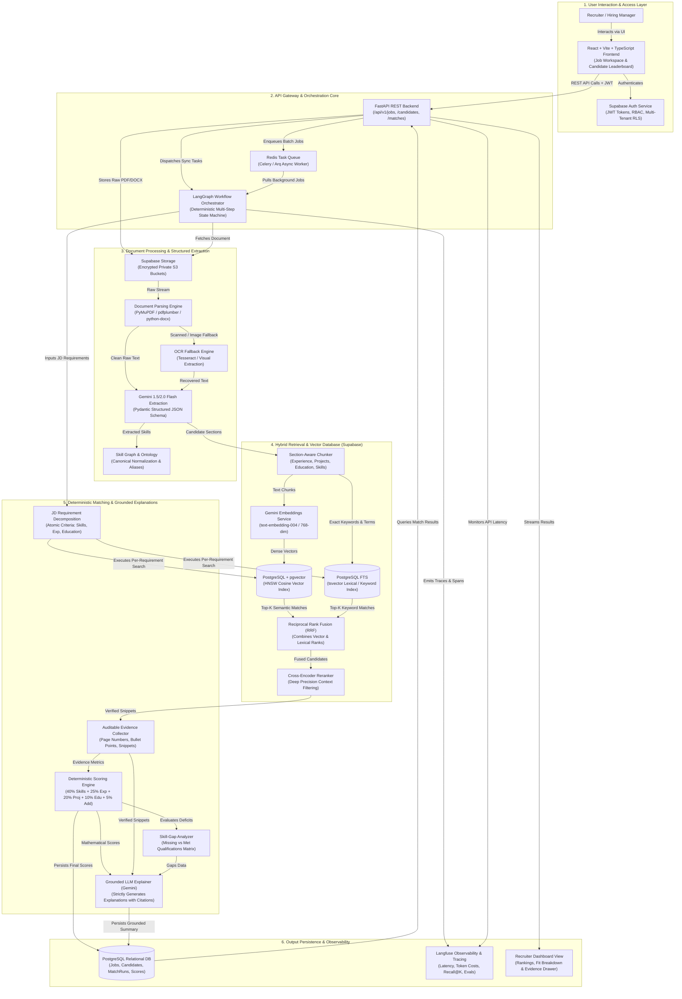
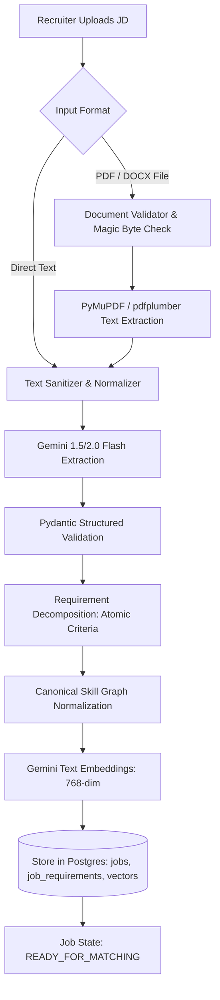
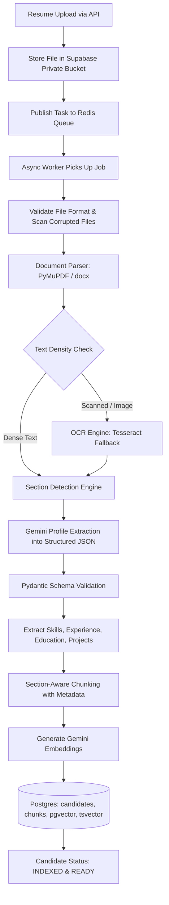
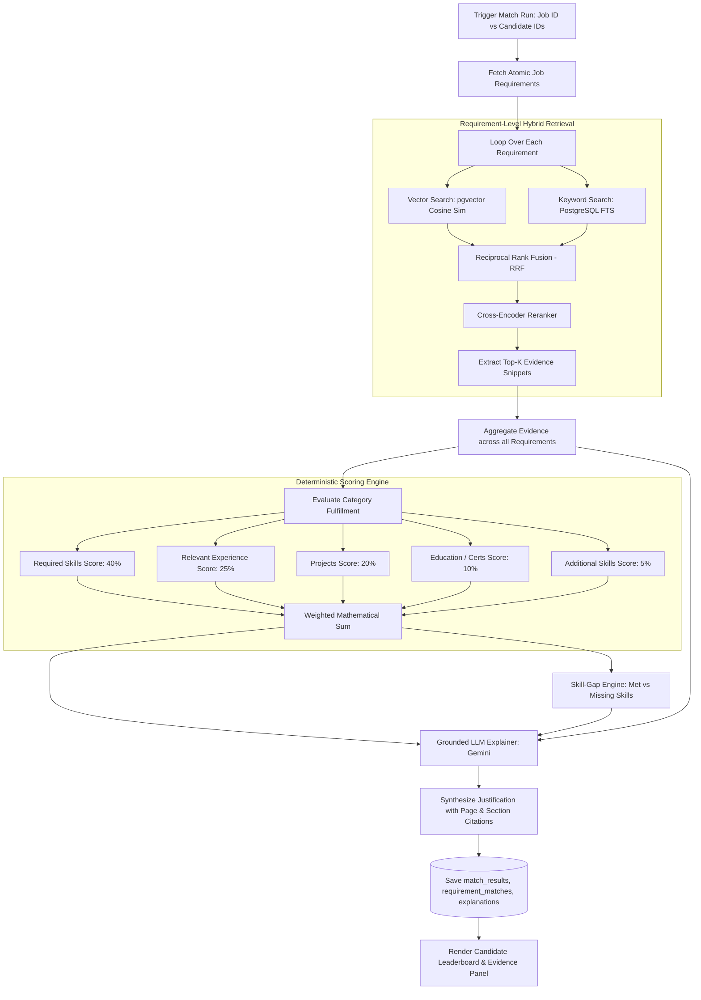
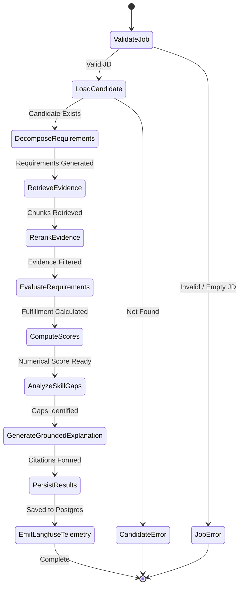
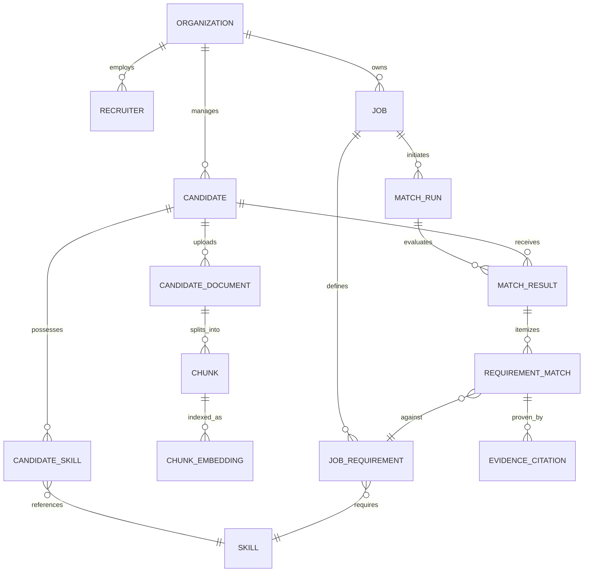

# System Workflows, Architecture & Engineering Roadmap

> **Visual architectural diagrams, workflow specifications, and phased implementation milestones for the AI Recruitment & Candidate Intelligence Platform.**  
> *Raw Mermaid Source File: [`docs/project_workflow_and_phases.mmd`](project_workflow_and_phases.mmd)*

---

## 📑 Table of Contents
1. [Master System Architecture & Pipelines](#1-master-system-architecture--pipelines)
2. [Pipeline A — Job Intelligence Workflow](#2-pipeline-a--job-intelligence-workflow)
3. [Pipeline B — Candidate Intelligence Workflow](#3-pipeline-b--candidate-intelligence-workflow)
4. [Pipeline C — Matching & Grounded Explanation Workflow](#4-pipeline-c--matching--grounded-explanation-workflow)
5. [LangGraph Execution State Machine](#5-langgraph-execution-state-machine)
6. [Data Model & Entity-Relationship Diagram](#6-data-model--entity-relationship-diagram)
7. [9-Phase Implementation Roadmap](#7-9-phase-implementation-roadmap)

---

## 1. Master System Architecture & Pipelines

This diagram represents the end-to-end topology: from user interaction in the React dashboard, through FastAPI and LangGraph orchestration, to Supabase Storage, pgvector, deterministic scoring, and Langfuse observability.

---

## 2. Pipeline A — Job Intelligence Workflow

Transforms raw job posts into structured, queryable atomic requirements with embeddings and canonical skill mappings.

---

## 3. Pipeline B — Candidate Intelligence Workflow

Processes unstructured resumes into section-aware chunks, structured entities, embeddings, and full-text indexes.

---

## 4. Pipeline C — Matching & Grounded Explanation Workflow

Executes requirement-level hybrid RAG, applies deterministic mathematical scoring, performs skill-gap analysis, and generates cited justifications.

---

## 5. LangGraph Execution State Machine

Illustrates the fault-tolerant state transitions executed by the LangGraph orchestrator.

---

## 6. Data Model & Entity-Relationship Diagram

Core relational schema showing how jobs, candidates, chunks, vectors, and match scores interconnect.

---

## 7. 9-Phase Implementation Roadmap

The progressive milestone roadmap from database foundation to full enterprise observability.

```mermaid
flowchart TD
    subgraph PHASE1 ["Phase 1: Foundation (Current)"]
        M1["• SQLite / Postgres Core Tables\n• SQLAlchemy / SQLModel Setup\n• Initial FastAPI CRUD Endpoints"]
    end

    subgraph PHASE2 ["Phase 2: Supabase & Vector Storage"]
        M2["• Supabase Project & Auth Setup\n• pgvector Extension & HNSW Index\n• Private S3 Storage Buckets & RLS"]
    end

    subgraph PHASE3 ["Phase 3: Document Processing Engine"]
        M3["• PyMuPDF & pdfplumber PDF Extraction\n• python-docx Parser\n• Tesseract OCR Fallback for Scans"]
    end

    subgraph PHASE4 ["Phase 4: Structured Intelligence"]
        M4["• Gemini 1.5/2.0 Flash Extraction\n• Pydantic Profile & JD Validation\n• Relational Skill Graph & Normalization"]
    end

    subgraph PHASE5 ["Phase 5: Hybrid RAG & Reranking"]
        M5["• Gemini Embeddings (text-embedding-004)\n• Section-aware Chunking with Page Tags\n• pgvector Cosine + Postgres FTS\n• Reciprocal Rank Fusion & Cross-Encoder"]
    end

    subgraph PHASE6 ["Phase 6: Matching & Deterministic Scoring"]
        M6["• Atomic Requirement-Level Matching\n• Deterministic Weighted Scoring Algorithm\n• Automated Skill-Gap Identification"]
    end

    subgraph PHASE7 ["Phase 7: Grounded Explanations"]
        M7["• Citation Generation (Page & Snippet Link)\n• Grounded Justification Prompts\n• Anti-Hallucination Guardrails"]
    end

    subgraph PHASE8 ["Phase 8: LangGraph & Async Workers"]
        M8["• LangGraph State Machine Graph\n• Redis Queue & Background Workers\n• Non-blocking Batch Resume Processing"]
    end

    subgraph PHASE9 ["Phase 9: Observability & Production"]
        M9["• Langfuse Tracing & Latency Telemetry\n• Retrieval Recall@K & Evals Suite\n• Dockerization & CI/CD Pipeline"]
    end

    PHASE1 ==> PHASE2 ==> PHASE3 ==> PHASE4 ==> PHASE5 ==> PHASE6 ==> PHASE7 ==> PHASE8 ==> PHASE9
```

---

## 🔗 Related Resources
- **Full Architecture Blueprint**: [`docs/ARCHITECTURE.md`](ARCHITECTURE.md)
- **Standalone Mermaid Flowchart**: [`docs/project_workflow_and_phases.mmd`](project_workflow_and_phases.mmd)
- **Project Overview & Tech Stack**: [`README.md`](../README.md)
